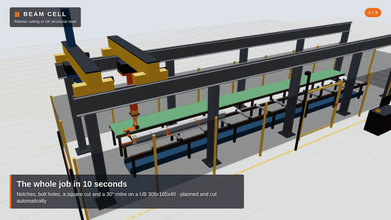

# BEAM CELL

### Robotic cutting of UK structural steel

**Two robot arms on an overhead gantry (12 m or 20 m long) that cut beams to size: bolt holes, slots, notches,
mitres and cut-to-length. Drawings in, finished beams out.**

By **Ravi Mahadeva** · UK codes · runs on an NVIDIA Jetson Orin Nano · opens in any web browser



▶ **[Watch the 30-second video](docs/video/beam_cell_30s.mp4)**

> 🤝 **Looking for collaborators and sponsors** - steel fabricators, engineers, robotics and automation
> people, and anyone who can help with parts, workshop space or test steel:
> **[get in touch](https://github.com/rvi007/steel-beam-cutting-cell/issues/new/choose)**.
> You're welcome to read everything here; using, building on or selling the code or the design needs
> written permission - see [LICENSE](LICENSE).

---

## What it does

Two robot "hands" hang from an overhead gantry above a 12-metre roller bed:

| | The **Cutter** (orange) | The **Handler** (blue) |
|---|---|---|
| Tool | plasma torch | electromagnet |
| Job | bolt holes, slots, openings, notches (copes), mitres, cut-to-length | holds each part while it is cut free, then carries it to the outfeed table |

You give it parts, as **NC1 files** from Tekla, Advance Steel or SDS2, or drawn on screen. It then:

1. **checks every part against the UK codes**, and tells you what is wrong and why,
2. **fits the parts onto stock bars** to waste as little steel as possible,
3. **plans every move of both arms** and checks they never collide,
4. **plays the whole job in 3D**, with a real safety system around it.

Or use **manual cut**: click on the beam to put a hole or a cut exactly there.

Everything in the 3D view is real CAD: the same solids are in the STEP files in `cad/`. There is
also a **1:10 desk-top prototype**, about £1,150 to build, with a shopping list and an assembly drawing.

## Start it

On the Jetson (or any Linux PC or Mac):

```
git clone https://github.com/rvi007/steel-beam-cutting-cell.git
cd steel-beam-cutting-cell
sudo apt install python3-numpy python3-opencv     # once; OpenCV is only needed for the camera
./start.sh
```

Then open **http://localhost:8080** in a web browser. From a phone, tablet or laptop on the same Wi-Fi,
use the address the terminal prints (for example `http://192.168.1.20:8080`).

**Every time after that:** `cd steel-beam-cutting-cell`, then `git pull` (to get the latest version), then `./start.sh`.

**Start it automatically when the Jetson boots:** see [docs/JETSON_SETUP.md](docs/JETSON_SETUP.md).

**Something not working?** Run `python3 -m beamcell.doctor`. It checks everything and tells you what to fix.

## A 5-minute tour

1. **Safety tab**: press **Reset**, tick the pre-start checklist and confirm. Like a real machine, nothing moves until you do.
2. **Machine tab**: example parts are already loaded. Press **Plan this bar**, then **Run**.
   Press **Follow Cutter** to watch the holes and notches being cut, and **Follow Handler** to watch a finished beam carried away.
   Point at anything in 3D to see what it is.
3. **Parts tab**: drag in NC1 files from Tekla, or pick *Add an example*. Every face is drawn,
   with its UK code checks. Click a part to edit it, for example to add a bolt group or a notch.
4. **Manual cut** (top left of the Machine tab): pick a section and a length, click on the beam to put a hole there,
   press **+ Cut** to cut it, then **Plan these cuts** and **Run**.
5. **E-STOP** (or the Esc key) while it runs: everything stops. Release it, press Reset, then Start to carry on.
6. When a job finishes, the **Job finished** window asks what next: next bar, run again or **Delete this job**.
   **Job history & saved jobs** (Machine tab) lists every job that ran, whether it ran **clean** or was stopped
   (each E-stop, gate or camera stop with its time), each with a **Delete** button.
7. **Prototype tab**: the 1:10 prototype in 3D. Every part is numbered, matching the shopping list. Click a part to see what it is and where to buy it.
8. **Camera tab**: start the camera and walk towards the machine. It slows down when you get close and stops when you get too close.
9. **Plasma tab**: plasma doesn't always cut the same, so try settings on a test piece, then save the ones that work, named after the beam.
   Next time that beam is cut, the Machine tab uses them automatically.
10. **Reports** (top right): every stop during a job saves a problem report. Add a note and press **Send to developer**.
11. **Machine size** (Machine tab): 12 m or 20 m long, 3 m wide. Stock bars up to 20 m; the 3D model, planning and checks follow.
12. **Bar check at Start**: after the safety checks, the Cutter measures the bar and checks it against the job (section, thicknesses,
   length, every hole, holes already in the bar). If it doesn't match, the job doesn't start and a window says why.
   Try it: Sensors tab, *Bar on the bed*, pick "a bar too short", then press Run. When the bar matches, a window shows the
   program next to what was measured on the cutting area (web and flange), then cutting starts.
13. **Sensors tab**: every sensor (two cameras, bar finding, torch, magnet, safety), the **bar check**, the **plasma settings**,
   and what each hand does for every stop. Press **Simulate** on "load slipping" or "object on the bed" and watch it react.

<details>
<summary><b>Camera not working?</b></summary>

1. Run `python3 -m beamcell.doctor`. The **Cameras** line lists every camera Linux can see and says what's wrong.
2. In the app's Camera tab, leave **Auto** selected, or pick the camera from the list.
3. Common fixes:
   - **No camera found at all:** plug the USB camera straight into the Jetson (not into an unpowered hub), or reseat the CSI ribbon cable (blue side towards the latch), then reboot.
   - **"not in the video group":** run `sudo usermod -aG video $USER`, then log out and back in.
   - **CSI ribbon camera:** it needs the Jetson's own OpenCV (`sudo apt install python3-opencv`), not `pip install opencv-python`. Test the camera with `nvgstcapture-1.0`.
   - **Camera busy:** close any other program that is using it (Cheese, a browser tab).
</details>

## Documents

| Read this | To learn about |
|---|---|
| [Safety](docs/SAFETY.md) | **stops, UK law and standards, risk assessment, E-stop wiring** |
| [Sensors](docs/SENSORS.md) | **the two cameras, how the beam is found and measured, what each hand does when something goes wrong, the standards** |
| [Plasma](docs/PLASMA.md) | how the torch finds the steel and holds its height; settings for each kind of cut |
| [How the machine works](docs/MACHINE.md) | the layout, how a bar is cut, and a map of the code |
| [UK codes](docs/UK_CODES.md) | every UK rule it checks, and where each one comes from |
| [NC1 files](docs/NC1_FILES.md) | getting parts out of Tekla: what is read, faces and coordinates |
| [The 1:10 prototype](docs/PROTOTYPE.md) | **what to buy (about £1,150), how to build it, safety wiring** |
| [Shopping list (PDF)](docs/Prototype_Shopping_List.pdf) | every part with its price and a link to buy it, to print out |
| [Assembly drawing (PDF)](docs/Prototype_Assembly.pdf) | every part numbered and shown where it goes |
| [Jetson setup](docs/JETSON_SETUP.md) | running on the Orin: start at boot, full-screen mode, camera, YOLO, memory |
| [The AI advisor](docs/ASSISTANT.md) | "what's happening" in plain English, and the optional AI advisor |
| [A scale model](docs/SCALE_MODEL.md) | a static display model at 1:20 or 1:100 |
| [Jetson specs](docs/JETSON_SPECS.md) | the Orin's hardware and software |
| [How the code works](docs/HOW_IT_WORKS.md) | **a guided tour: which file does what, how the screen and the engine work together, the journey of a job** |
| [For developers](docs/DEVELOPMENT.md) | how the code fits together, and the rules for changing it |

## Honest limits

- **It is a simulation and a planner, not yet a machine controller.** It doesn't drive motors yet.
  The prototype guide explains what's needed for that.
- **Check NC1 files against their drawings.** The face conventions follow the DSTV standard as
  usually exported. Check one of your own Tekla parts against its drawing (see [NC1 files](docs/NC1_FILES.md)).
- **The safety functions are software.** They behave like a real safety system, but a real machine needs
  them in certified safety hardware, and a camera with AI is never a safety device on its own (see [Safety](docs/SAFETY.md)).
- **Section sizes come from published Blue Book data.** Check them against current mill data before real fabrication.

<details>
<summary><b>For developers: folders, tests, CAD and the video</b></summary>

### What's in each folder

```
steel-beam-cutting-cell/
├── start.sh              starts the app (./start.sh --camera 0 starts it with the camera on)
├── config/cell.toml      all the settings: safety, camera zones, GPIO wiring, AI advisor, port
├── beamcell/             the engine (Python)
│   ├── server.py         web server and the API the browser talks to
│   ├── safety.py         safety controller: E-stop, interlocks, modes, reset/start, watchdogs
│   ├── history.py        job history (jobs/history.json)
│   ├── plasma_presets.py saved plasma settings that worked (plasma_settings/)
│   ├── reports.py        problem reports for the developer after every stop (reports/)
│   ├── gpio_inputs.py    real E-stop / gate / light curtain / reset buttons on the Jetson's pins
│   ├── assistant.py      "what's happening" in plain English + the optional AI advisor
│   ├── doctor.py         system check: python3 -m beamcell.doctor
│   ├── sections.py       UK section library and exact cross-sections (data/uk_sections.json)
│   ├── uk_codes.py       UK code values: hole sizes, edge distances, grades
│   ├── parts.py          parts, notches, mitres, the code checks, nesting on bars
│   ├── nc1.py            reads and writes DSTV NC1 files
│   ├── arm.py, machine.py   the 6-axis arms and the cell's sizes
│   ├── planner.py        plans every move of both hands for a bar
│   ├── manual.py         manual cutting
│   ├── collisions.py     checks the arms never touch the steel
│   ├── cad.py            makes the CAD: STEP files and the 3D view's models (needs CadQuery)
│   └── vision.py         camera + YOLO person detection + safety zones
├── web/                  the app in the browser (index.html, css/, js/, models/, vendor/three.js)
├── cad/                  STEP files: the whole cell, the 1:10 prototype, every example part
├── examples/nc1/         example NC1 files of typical UK parts
├── docs/                 the documents above, images, video, PDFs
├── tools/                makes the example files, PDFs, assembly pictures and the video
├── deploy/               start-at-boot service for the Jetson
├── tests/                automatic tests (GitHub runs them on every push)
├── models/               put YOLO .onnx models here (see docs/JETSON_SETUP.md)
└── jobs/, logs/, plasma_settings/, reports/
                          your saved jobs, job history, safety log, plasma settings and problem reports (not in git)
```

### Tests

```
python3 -m unittest discover -s tests -t .     # about 1 minute
python3 tests/sweep_sections.py                # every UK section, about 4 minutes
```
GitHub runs the tests on every push: with the Orin's versions (Python 3.12, numpy 1.26.4,
OpenCV 4.6) and the latest ones, plus a browser test of the whole app and a CAD build.

### Make the CAD again (after changing the machine)

On a PC (CadQuery is big; the Jetson doesn't need it because the files are already in the repo):
```
pip install cadquery
python3 -m beamcell.cad                 # everything: parts, the cell, the prototype
python3 -m beamcell.cad parts my.nc1    # STEP solids of your own NC1 parts
```

### Make the video again

```
python3 -c "import beamcell.server as s; s.SAFETY.cfg['heartbeat_timeout_s'] = 600; s.main(['--port', '8099'])" &
node tools/make_video.mjs http://localhost:8099 docs/video/beam_cell_30s.mp4
```
</details>

## Author and licence

**Ravi Mahadeva**: design, development and the prototype.

© 2026 Ravi Mahadeva. All rights reserved. See [LICENSE](LICENSE). The UK section data comes
from the `steelsnakes` package (GPL-2.0), and three.js is MIT-licensed (`web/vendor/LICENSE-three.txt`).
