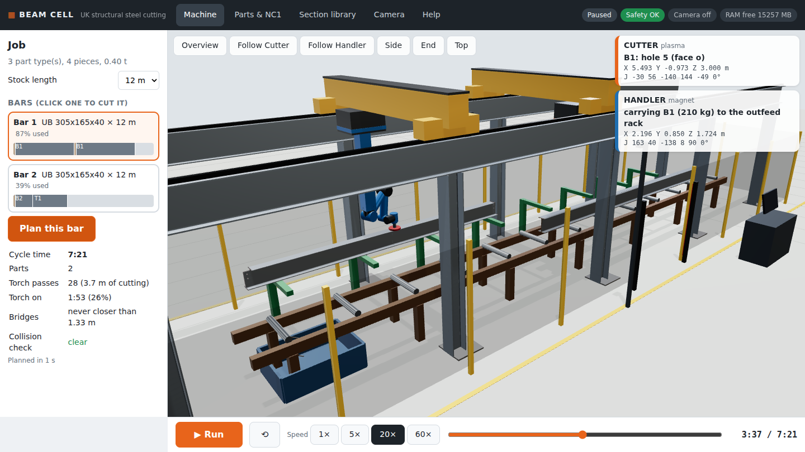
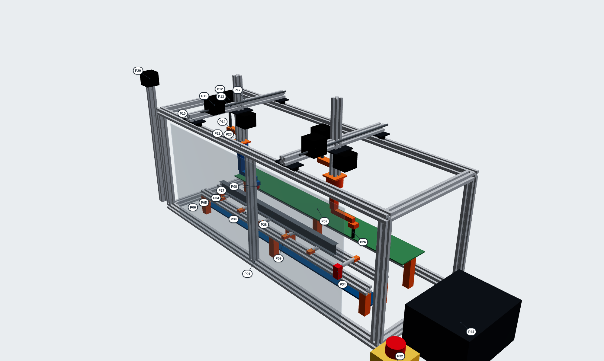

# Steel Beam Cutting Cell

**A 12 m gantry cell that cuts UK structural steel sections - holes, slots, notches, mitres
and cut-to-length - with two robot hands on an overhead gantry.**

By **Ravi Mahadeva** · prototype software for the NVIDIA Jetson Orin Nano · UK codes only

A working prototype of a **structural steel beam cutting cell**, to UK codes. Two robot
"hands" hang from an overhead gantry over a 12 m work area:

- **Cutter** (orange) - plasma torch: bolt holes, slots, openings, notches (copes), mitres and cut-to-length.
- **Handler** (blue) - magnet: holds each part while it's cut free and puts it on the outfeed table.

You give it parts - **NC1 files from Tekla** (or Advance Steel, SDS2), or parts you make on
screen - and it nests them on stock bars, plans every move of both hands, checks they never
collide, and plays the whole job in 3D. Or cut by hand: **Manual cut** - click on the steel
to put a hole or a cut there. A camera with YOLO person detection stops the machine when
someone walks into the cell.

The 3D view **is the CAD model**: the same solids are in `cad/beam_cell.step` (open it in
Fusion 360, SolidWorks, FreeCAD or Onshape), every part is a STEP solid with its holes and
notches, and there's a **1:10 desk-top prototype** in CAD with its shopping list and assembly drawing
([docs/PROTOTYPE.md](docs/PROTOTYPE.md)). Things obey gravity: parts rest on the rollers or
the outfeed table, offcuts fall into the scrap tray.

It runs on the **Jetson Orin Nano** with nothing to install, and you open it in a web browser.

**Safety is built in the way a real machine does it**: a red E-STOP on every screen (and the
Esc key), interlocked gate, light curtain, fume-extraction interlock, camera warning and danger
zones, Auto / Manual (250 mm/s, hold-to-run) / Maintenance (isolated, Lock Out Tag Out) modes,
latching stops with separate Reset and Start, a pre-start checklist, watchdogs and an audit log -
following PUWER, BS EN ISO 13849, BS EN 60204-1, BS EN ISO 13850 and BS EN ISO 10218. It's a
prototype: real machines need these functions in certified safety hardware (see
[docs/SAFETY.md](docs/SAFETY.md)).





## Start it

```
cd ~/steel-beam-cutting-cell
./start.sh
```
Open **http://localhost:8080**. From a laptop or tablet on the same Wi-Fi, use the address the
terminal prints (e.g. `http://172.20.10.5:8080`).

Needs Python 3 and numpy (already on the Jetson). OpenCV is only needed for the camera.

### Camera not working?

1. `python3 -m beamcell.doctor` - the **Cameras** line lists every camera Linux can see
   (`/dev/video0 USB - ...`, `CSI`, ...) and tells you what's wrong.
2. In the app, Camera tab: leave **Auto** selected (it tries the USB cameras, then the CSI ribbon
   camera) or pick the exact camera from the list. The status line says why one won't start.
3. Common fixes:
   - No `/dev/video*` at all: plug the USB camera straight into the Jetson (not an unpowered hub),
     or reseat the CSI ribbon (blue side to the latch), then reboot.
   - "not in the video group": `sudo usermod -aG video $USER`, then log out and in.
   - CSI camera: it needs the Jetson's own OpenCV (`sudo apt install python3-opencv`), not
     `pip install opencv-python` (that one has no GStreamer). Test it with `nvgstcapture-1.0`.
   - Another program (Cheese, a browser tab) is using the camera: close it.

## Show it in 5 minutes

0. **Safety** tab - press **Reset**, tick the pre-start checklist and confirm. (The machine
   won't move until you do, like a real one.)
1. **Machine** tab - three example parts are already loaded and nested on two UB 305 bars.
   Press **Plan this bar**, then **Run**. Use *Follow Cutter* to watch the torch cut the holes
   and notches; *Follow Handler* to see it carry a finished beam to the outfeed table.
   Point at anything in 3D to see what it is.
2. **Parts & NC1** - drag in NC1 files from Tekla (or *Add an example*). Each part shows a
   drawing of every face and its UK code checks. Click a part to edit it: add a fin-plate bolt
   group (M20 in 22 mm holes), notch it to clear a UB 457 (Blue Book N x n), see the checks update.
3. **Section library** - every UK section (993 sizes) in 3D; download any of them as an STL at
   1:10, 1:20 ... for 3D printing.
4. **Camera** - start the camera and walk into the amber zone (machine slows to 25%), then the
   red zone (machine stops until the zone is clear and you press Reset).
5. Press **E-STOP** (or Esc) while it runs: everything freezes. Release, Reset, Start to carry on.
   Open the gate on the Safety tab: protective stop. Try Manual mode: it only moves while you hold the button.
6. **Machine** tab, **Manual cut** (top left) - pick a section and length, click on the web to put a
   hole there (it snaps to the centre line), **+ Cut** to cut it, check, **Plan these cuts**, Run.
7. **Section library** - *CAD files*: download the whole cell, the prototype or any example part as STEP.

## What's in each folder

```
steel-beam-cutting-cell/
├── start.sh              start the app (./start.sh --camera 0 to start with the camera)
├── config/cell.toml      ALL settings: safety, camera zones, GPIO wiring, advisor, port
├── beamcell/             the engine (Python)
│   ├── server.py         web server + API the browser talks to
│   ├── safety.py         the safety controller: E-stop, interlocks, modes, reset/start, watchdogs
│   ├── gpio_inputs.py    optional real E-stop / gate / light curtain / reset buttons on the Jetson's pins
│   ├── assistant.py      "what's happening" in plain English + optional AI advisor
│   ├── doctor.py         system check: python3 -m beamcell.doctor
│   ├── config.py         reads config/cell.toml
│   ├── sections.py       UK section library and exact cross-sections
│   ├── data/uk_sections.json   the section sizes (BS 4-1, BS EN 10056-1, 10210, 10219)
│   ├── uk_codes.py       UK code values: hole sizes, edge distances, grades
│   ├── parts.py          parts, notches, mitres, the code checks, nesting on bars
│   ├── nc1.py            reads / writes DSTV NC1 files (Tekla)
│   ├── arm.py            6-axis robot arm maths
│   ├── machine.py        the cell's sizes and the two hands
│   ├── planner.py        plans every move of both hands for a bar (and where loose pieces fall)
│   ├── manual.py         manual cutting: holes, cuts and notches by hand
│   ├── collisions.py     checks the arms never touch the steel
│   ├── cad.py            makes the CAD: STEP files and the 3D view's model (needs CadQuery, on a PC)
│   └── vision.py         camera + YOLO person detection + safety zone
├── web/                  what you see in the browser
│   ├── index.html        the page
│   ├── css/style.css     its look
│   ├── js/               app.js (machine), manual.js, parts.js, library.js, camera.js, safety.js,
│   │                     scene.js (3D), geometry.js (steel)
│   ├── models/           the machine for the 3D view (GLB, made by beamcell/cad.py)
│   └── vendor/           three.js 3D library (MIT licence), kept here so no internet is needed
├── cad/                  STEP files: beam_cell.step, prototype_1to10.step, parts/*.step, prototype cut list + positions
├── examples/nc1/         example NC1 files of typical UK parts (tools/make_examples.py writes them)
├── tools/                make_examples.py
├── models/               put YOLO .onnx models here (see docs/JETSON_SETUP.md)
├── jobs/                 jobs you save from the app (not in git)
├── logs/                 safety event log (not in git)
├── docs/                 how everything works (below)
├── deploy/               start-at-boot service for the Jetson
└── tests/                automatic tests (GitHub runs them on every push)
```

## Documents

| Read | For |
|---|---|
| [docs/SAFETY.md](docs/SAFETY.md) | **stops, UK law and standards, risk assessment, E-stop wiring** |
| [docs/ASSISTANT.md](docs/ASSISTANT.md) | "what's happening" and the optional AI advisor - is an LLM/VLM worth it? |
| [docs/MACHINE.md](docs/MACHINE.md) | the machine, how a bar is cut, safety, code map |
| [docs/UK_CODES.md](docs/UK_CODES.md) | every UK rule it checks and where it comes from |
| [docs/NC1_FILES.md](docs/NC1_FILES.md) | NC1 files from Tekla: what's read, faces and coordinates |
| [docs/JETSON_SETUP.md](docs/JETSON_SETUP.md) | running on the Orin, start at boot, kiosk mode, camera, YOLO, memory |
| [docs/PROTOTYPE.md](docs/PROTOTYPE.md) | **the 1:10 desk-top prototype: CAD, shopping list (~£1,100), safety wiring, build stages** |
| [docs/Prototype_Shopping_List.pdf](docs/Prototype_Shopping_List.pdf) | the shopping list to print: part numbers, total cost, buy links |
| [docs/Prototype_Assembly.pdf](docs/Prototype_Assembly.pdf) | the prototype's assembly drawing: part-number balloons, exploded view, every position |
| [docs/prototype_bom.csv](docs/prototype_bom.csv) | the shopping list as a spreadsheet |
| [docs/SCALE_MODEL.md](docs/SCALE_MODEL.md) | a static display model at 1:20 / 1:100: sizes, STL files |
| [docs/JETSON_SPECS.md](docs/JETSON_SPECS.md) | the Orin's hardware and software |
| [docs/DEVELOPMENT.md](docs/DEVELOPMENT.md) | developer notes: how the code fits together, rules for changes |

## Check your computer

```
python3 -m beamcell.doctor          # what's ready, what's missing, and a plan
python3 -m beamcell.doctor --save   # also writes docs/SYSTEM_CHECK.md - push it to share your setup
```

## Tests

```
python3 -m unittest discover -s tests -t .     # about 45 s
python3 tests/sweep_sections.py                # every UK section, about 4 min
```
GitHub runs the tests on every push with the Orin's versions (Python 3.12, numpy 1.26.4,
OpenCV 4.6) and the latest ones, a browser test of the whole app, and a CAD job that builds
every solid with CadQuery.

## Make the CAD again (after changing the machine)

On a PC (CadQuery is big; the Jetson doesn't need it - the files are in the repo):
```
pip install cadquery
python3 -m beamcell.cad                 # everything: parts, the cell (+ the 3D view's model), the prototype
python3 -m beamcell.cad parts my.nc1    # STEP solids of your own NC1 parts
```

## Honest limits

- It's a simulation and a planner, not a machine controller - there are no motor outputs yet
  (the prototype guide says what's needed: a FluidNC G-code streamer and the small arms' maths).
- The NC1 face conventions follow the DSTV standard as commonly exported; check one of your
  own Tekla parts against its drawing (see `docs/NC1_FILES.md`).
- The software stops behave like a real safety system but are not safety-rated - a real machine
  needs them in certified hardware, and a camera with AI is never a safety device (docs/SAFETY.md).
- Section sizes are from the Blue Book data in the `steelsnakes` package (GPL-2.0) - check
  against current mill data before real fabrication.

## Author

**Ravi Mahadeva** - design, development and the prototype.

Copyright © 2026 Ravi Mahadeva. All rights reserved. The UK section data comes from the
`steelsnakes` package (GPL-2.0); three.js is MIT-licensed (`web/vendor/LICENSE-three.txt`).

