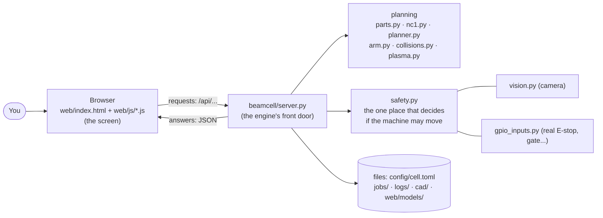
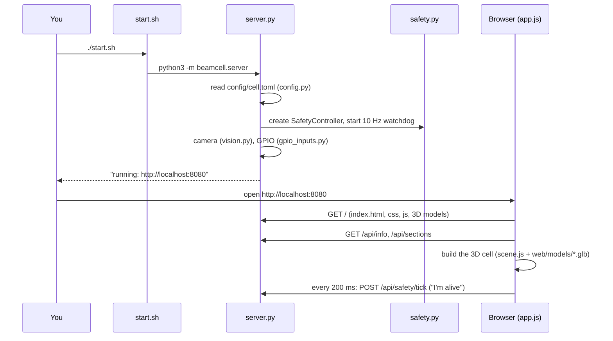
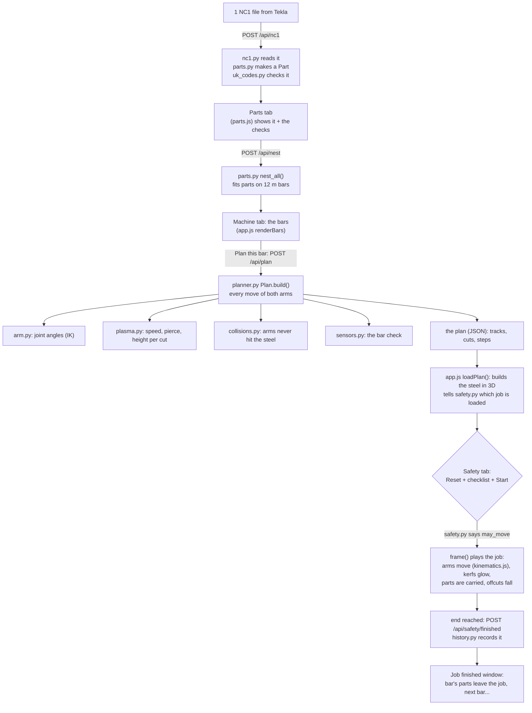
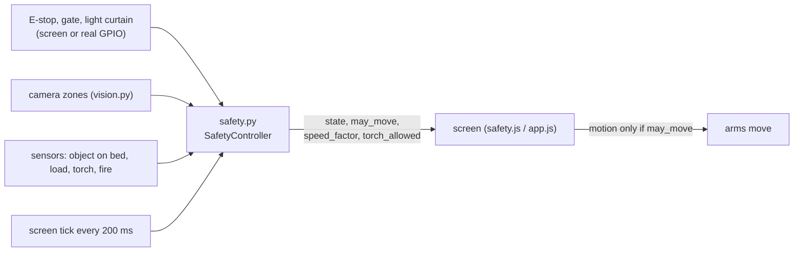

# How the code works - a guided tour

This page explains how BEAM CELL is put together: which file does what, how the screen talks to the
engine, and what happens, step by step, from an NC1 file to a cut beam. Read it top to bottom once;
afterwards use it as a map.

## 1. The big picture: two programs that talk to each other

BEAM CELL is **two programs**:

| | The **engine** (Python) | The **screen** (JavaScript, in a web browser) |
|---|---|---|
| Folder | `beamcell/` | `web/` |
| Runs on | the Jetson | any browser: on the Jetson, a laptop, a tablet |
| Does | all the thinking: UK checks, nesting, planning, **safety decisions**, sensors, saving jobs | everything you see: tabs, buttons, the 3D view, playing the job |
| Master file | **`beamcell/server.py`** | **`web/js/app.js`** (loaded by `web/index.html`) |

They talk over **HTTP**, the same way a website talks to its server: the screen asks
(`GET /api/info`, `POST /api/plan` ...), the engine answers with **JSON** (plain data).

### The "main" files

- **`start.sh`** - what you run. It only does one thing: `python3 -m beamcell.server`.
- **`beamcell/server.py`** - **the master file of the engine.** `main()` at the bottom reads the
  settings, starts the safety watchdog, the camera and GPIO, then starts the web server. Every
  `/api/...` request arrives in its `Handler` class and is passed to the right module.
- **`web/index.html`** - the page: every tab, button and box, as HTML.
- **`web/js/app.js`** - **the master file of the screen.** Its `start()` function loads the data,
  builds the 3D view and switches on every tab; its `frame()` loop draws the machine 60 times a second.

## 2. Starting up: what happens when you type `./start.sh`

The **tick** every 200 ms matters: if the screen stops answering (crashed, network lost), the
safety controller's **watchdog** stops the machine within 2 seconds.

## 3. The journey of a job: from an NC1 file to a cut beam

Step by step, with the file that does each part:

| # | What happens | Screen (browser) | Engine (Python) |
|---|---|---|---|
| 1 | You drop an NC1 file | `parts.js` `importFiles()` | `nc1.py` `read()` → `parts.py` `Part` |
| 2 | Each part is checked against the UK rules | the ✓ / ✗ in the part list | `parts.py` `Part.check()` using `uk_codes.py` |
| 3 | Parts are fitted onto stock bars | Machine tab, "Bars" | `parts.py` `nest_all()` |
| 4 | You press **Plan this bar** | `app.js` `planBar()` | `server.py` `plan_bar()` → `planner.py` `Plan(bar).build()` |
| 5 | The planner works out every move | - | `planner.py` (order of cuts, approaches, the Handler's lift and carry) + `arm.py` (joint angles) + `plasma.py` (speeds) + `collisions.py` |
| 6 | The plan comes back and is drawn | `app.js` `loadPlan()`, `geometry.js` (the steel), `scene.js` (the 3D cell) | - |
| 7 | You press Reset, confirm the checklist, Start | `safety.js` buttons | `safety.py` `reset()`, `confirm_checklist()`, `start()` |
| 8 | The job plays | `app.js` `frame()`: moves time forward **only while** the safety controller says `may_move` | `safety.py` checks every input 10 times a second |
| 9 | The job ends | `app.js` `finishJob()` | `safety.py` `finished()`, `history.py` `add()` |

**Why the plan is made in Python, but played in the browser:** planning is heavy maths, done once.
Playing it back is just "where is each arm at time *t*" - the plan holds every arm's position
over time (its *tracks*), and `kinematics.js` `trackAt()` reads them. When the real machine is
built, the same plan goes to the motors instead of (as well as) the 3D view.

## 4. Safety: who is in charge

- **`safety.py` is the only place that decides** whether the machine may move. The screen never
  decides on its own; it asks and obeys (and stops by itself if it can't reach the controller).
- Every stop **latches**: clearing the cause is not enough - Reset, then Start.
- Each stop has a fixed **decision** for each hand (`DECISIONS` in `safety.py`, shown on the
  Sensors tab and in [SENSORS.md](SENSORS.md)).
- In the real machine the same functions must also be in certified safety hardware - see [SAFETY.md](SAFETY.md).

## 5. Every file, and what it is for

### The engine - `beamcell/`

| File | In one line |
|---|---|
| **`server.py`** | **master file**: web server; every `/api/...` request; starts everything |
| `config.py` | reads `config/cell.toml` (all the settings) |
| `safety.py` | the safety controller: states, stops, Reset/Start, modes, watchdog, decisions |
| `gpio_inputs.py` | real E-stop / gate / light-curtain / reset buttons on the Jetson's pins |
| `vision.py` | the camera: finds it, YOLO person detection, warning / danger zones |
| `sections.py` + `data/uk_sections.json` | every UK steel section (UB, UC, PFC, angles, hollow...) and its exact shape |
| `uk_codes.py` | the UK rule numbers: hole sizes, edge distances, grades |
| `parts.py` | a **Part** (holes, notches, mitres), its checks, and **nesting** onto bars |
| `nc1.py` | reads and writes DSTV NC1 files (Tekla, Advance Steel) |
| `manual.py` | manual cutting: turns your clicks (holes, cuts, notches) into a bar the planner understands |
| `machine.py` | the cell's sizes and the two hands (where they park, their reach) |
| `arm.py` | the 6-axis arm maths: joint angles for a tool position (inverse kinematics) |
| `planner.py` | **plans the job**: order of cuts, every move of both hands, timing |
| `plasma.py` | the plasma cut chart: amps, speed, heights, pierce time for each kind of cut |
| `plasma_presets.py` | saved plasma settings that worked (`plasma_settings/`), used by the planner instead of the chart |
| `reports.py` | a problem report for the developer every time the machine stops during a job (`reports/`) |
| `collisions.py` | checks the arms never touch the steel or each other |
| `sensors.py` | every sensor (simulated until fitted) and the bar check |
| `history.py` | the job history (`jobs/history.json`) |
| `assistant.py` | "what's happening" in plain words, and the optional AI advisor |
| `doctor.py` | system check: `python3 -m beamcell.doctor` |
| `cad.py` | makes the CAD (STEP files and the 3D view's models) - run on a PC, not needed on the Jetson |

### The screen - `web/`

| File | In one line |
|---|---|
| `index.html` | the page: every tab, button and box |
| `css/style.css` | how it looks |
| **`js/app.js`** | **master file**: starts everything; Machine tab; plans; plays the job (`frame()`); job finished |
| `js/api.js` | two helpers to talk to the engine: `get()` and `post()` |
| `js/scene.js` | the 3D cell (three.js): lights, the machine models, the arms, sparks, camera views |
| `js/kinematics.js` | where each arm is at time *t* (reads the plan's tracks) |
| `js/geometry.js` | turns a steel section and its cuts into 3D shapes |
| `js/parts.js` | Parts tab: list, editor, import, save / open jobs |
| `js/manual.js` | Manual cut mode |
| `js/safety.js` | Safety tab, the E-stop button, the 200 ms tick to the engine |
| `js/sensors.js` | Sensors tab: sensors, bar check, stops and decisions, plasma chart |
| `js/jobs.js` | the Job history & saved jobs window |
| `js/plasma.js` | Plasma tab: try, save and reuse settings; the Machine tab's plasma choice |
| `js/reports.js` | the Reports button and window: problem reports, send to the developer |
| `js/library.js` | Sections tab (and STL / STEP downloads) |
| `js/prototype.js` | Prototype tab: the 1:10 model with part numbers |
| `js/camera.js` | Camera tab |
| `js/help.js` | Help tab |
| `models/*.glb` | the machine's 3D models (made by `beamcell/cad.py`) |
| `vendor/` | three.js, the 3D library (kept here so no internet is needed) |

### Everything else

| Folder | What's in it |
|---|---|
| `config/cell.toml` | **all the settings** - safety, camera zones, GPIO pins, plasma chart, port |
| `docs/` | these documents, images, the video, the shopping list and assembly PDFs |
| `cad/` | STEP files: the whole cell, the 1:10 prototype, the example parts |
| `examples/nc1/` | example NC1 files |
| `tests/` | automatic tests - GitHub runs them on every push (`.github/workflows/tests.yml`) |
| `tools/` | makes the example files, the PDFs, the assembly pictures and the video |
| `deploy/` | start-at-boot service for the Jetson |
| `jobs/`, `logs/` | your saved jobs, job history and safety log (on the Jetson only, not on GitHub) |

## 6. Following one button click through the code

**"Plan this bar"** - a good one to trace yourself:

1. `web/index.html`: `<button id="btn-plan">Plan this bar</button>`
2. `web/js/app.js`, in `start()`: `$("btn-plan").onclick = planBar;`
3. `planBar()` sends the job: `post("/api/plan", { parts, stock_length, bar })` (`web/js/api.js`)
4. `beamcell/server.py`, `do_POST()`: `if path == "/api/plan": return self._send(200, plan_bar(body))`
5. `plan_bar()` re-nests the parts, takes the bar you chose, and calls `plan_output()`:
   `Plan(bar).build()` in `planner.py`, `collisions.check_plan()`, `sensors.measure_bar()`
6. The answer (JSON) comes back to `planBar()`, which calls `loadPlan(plan)` in `app.js`
7. `loadPlan()` fills in the plan box, builds the steel in 3D, and registers the job with the safety controller

Every other button works the same way: **HTML button → a function in a `web/js` file → `/api/...`
→ `server.py` → a module in `beamcell/` → JSON back → the screen updates.**

## 7. Where to change things

| You want to... | Change |
|---|---|
| change a setting (speeds, zones, checklist, plasma chart) | `config/cell.toml`, then restart |
| change a UK rule | `beamcell/uk_codes.py` / `parts.py` `check()` |
| change how fast plasma cuts, or use your own cut chart | `beamcell/plasma.py` `CHARTS`, or save tried settings on the Plasma tab |
| send problem reports somewhere else | `config/cell.toml` `[reports]` (`github_repo`, `webhook_url`) |
| change a safety rule or what a hand does on a stop | `beamcell/safety.py` (`FAULTS`, `DECISIONS`) - and update the risk assessment |
| add a sensor | `beamcell/sensors.py` `SENSORS` (it then appears on the Sensors tab) |
| change how something looks | `web/css/style.css`, `web/index.html` |
| change the machine's size or shape | `beamcell/machine.py`, then `python3 -m beamcell.cad` on a PC to rebuild the models |

After any change: `python3 -m unittest discover -s tests -t .` runs the tests (about a minute).
