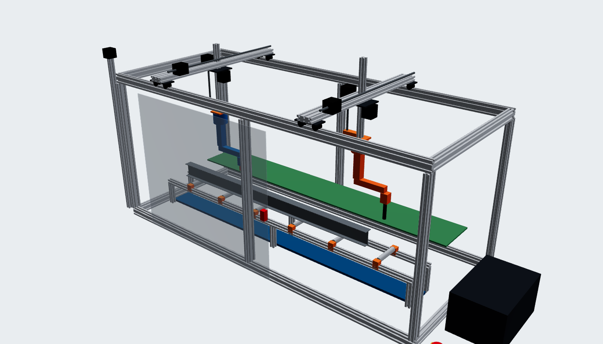

# The 1:5 working prototype - what to buy and how to build it

This is a **desktop version of the cell at 1:5** that really moves: two gantry bridges, two
small servo arms, cameras with YOLO, and a real hard-wired E-stop. It proves the software,
the motion planning, the vision and the safety circuit before anything full size is built.

- **CAD:** `cad/prototype_1to5.step` (open in Fusion 360 / SolidWorks / FreeCAD / Onshape).
  Every solid is named and says what it is (also in `cad/prototype_parts.csv`).
- **Cut list:** `cad/prototype_cut_list.csv` - every aluminium extrusion length (from the CAD).
- **Shopping list:** `docs/prototype_bom.csv` (open in Excel / Google Sheets) - the tables
  below are the same list.

Rebuild the CAD after changing the design: `python3 -m beamcell.cad prototype` (on a PC).



## Why 1:5, and what it does (honestly)

| | Full size | 1:5 prototype |
|---|---|---|
| Work area | 12 m x 3 m | 1.2 m x 0.6 m (frame 1.8 x 0.7 x 0.9 m) |
| Rail height | 3.4 m | 680 mm |
| Bridges | steel box girders, servo drives | 20x60 aluminium on V-wheels, NEMA 17 + GT2 belts |
| Lift (Z) | 2 m mast | 300 mm 20x20 on a T8 lead screw |
| Arms | 6-axis industrial arms | SO-101 servo arms (5 joints + 1, about 0.3 m reach) |
| Cutter | 130 A plasma torch | **a pen** in a sprung holder: it marks every cut line |
| Handler | 500 kg lifting magnet | 12 V 25 mm electromagnet |
| Steel | UK sections | 3D-printed UK sections at 1:5 with a steel strip on top |

1:5 is the scale where the small, cheap SO-101 arms are about the right size for the
machine (a full-size arm's reach divided by 5 is about what an SO-101 reaches).

**No real cutting on the prototype.** A plasma torch, a hobby laser over Class 2, or a
spindle on a servo arm would turn a desk model into a dangerous machine (UV, fumes,
fire, eye damage). The pen proves everything the software has to prove: where each hole,
notch and cut-off is, in what order, and that the torch path is right. The real cutting
belongs on the real machine, with the guarding in `docs/SAFETY.md`.

**Two differences from the simulation to know about:**
1. The SO-101 has **5 joints** (plus a gripper motor we use as a wrist roll), not 6 like the
   simulated arms. It can't point the tool in every direction - straight down and
   sideways (for the web) is fine for marking. The arm maths for the SO-101 has to be added
   to the software (stage 5 below).
2. The motors are driven by a **FluidNC motion controller** (an ESP32 board, flashed once
   from a web page - no Arduino programming). The Jetson sends it G-code over USB. Linux
   on the Jetson can't make the exact step pulses motors need; every CNC machine has a
   motion controller for this reason.

## Total cost

About **£1,900** for everything (prices checked October 2026, excluding postage; they
change - check before you buy). Where to save:
- Arms: buy the STS3215 servos and print the SO-101 parts yourself (~£130 per arm instead of £240).
- Safety relay: a used Pilz PNOZ s3 is ~£75 instead of ~£180. **Don't skip the safety relay
  or the E-stop** - learning to wire them properly is part of the point.
- Start with stage 1-2 (frame and gantry moving, ~£750) and add arms and vision after.

## Wiring the safety circuit (stage 5 - but build it FIRST, before motors move)

```
 mains -> IEC inlet (switch + fuse) -> 24 V PSU and 12 V PSU
                                          |            |
                       PNOZ s3 output contacts (13-14, 23-24), opened by:
                         - E-stop  (NC contact 1 -> channel 1, NC contact 2 -> channel 2)
                         - door interlock switch (in series with the E-stop)
                         - reset: blue button (manual, monitored)
                                          |            |
                              24 V to the motor drivers   12 V to the servos + magnet
 The Jetson and the FluidNC logic stay powered: they REPORT the stop, they don't make it.
 A spare NC contact on the E-stop -> Jetson GPIO (docs/SAFETY.md section 6) -> the app shows E-STOP.
```

- Press the E-stop: the motors and servos lose power at once (stop category 0). The arms
  sag under gravity - keep the model beam light and use the servo kit's holding torque only
  when powered.
- Release it: nothing moves until **Reset** on the relay, then **Reset** and **Start** in the app.
- Test it every session (it's on the app's pre-start checklist).

## Build stages

| Stage | What you build | Done when |
|---|---|---|
| 0 | Software on the Jetson (`./start.sh`), `python3 -m beamcell.doctor --save` | the app runs, the doctor is green |
| 1 | Frame, bed, outfeed table, scrap tray (cut list) | square and level (diagonals equal) |
| 5 | **Safety circuit and enclosure next** - E-stop, safety relay, door switch, reset | E-stop and door cut motor power (measure it) |
| 2 | Bridges, carriages, Z axes, motors, FluidNC, limit switches | every axis homes and jogs from the FluidNC web page |
| 4 | Cameras on the Jetson, YOLO zones on the Camera tab | a hand in the danger zone stops the app |
| 3 | Print and build the two SO-101 arms, mount them under the Z axes | each servo moves from the LeRobot / Feetech tools |
| 5b | Software: send the planned moves to FluidNC (G-code) and the arms (servo bus) | the prototype marks a B1 beam like the 3D view |
| 6 | Magnet on the Handler: lift a marked part to the outfeed table | part lands flat on the table |

Stage 5b is new software (a FluidNC G-code streamer and SO-101 arm maths for
`beamcell/`). Everything it needs - the plan, the safety states, the camera - is already
in the app.

## The shopping list

`docs/prototype_bom.csv` has the same list with supplier notes. Prices are approximate
(GBP, incl. VAT where known).


### Stage 1 - frame and bed (about £340)

| Item | What to look for | Qty | ~£ each | Where |
|---|---|---|---|---|
| V-slot 20x40 aluminium extrusion | cut to size: 4 x 1500, 6 x 600, 4 x 580 mm (cad/prototype_cut_list.csv) *(lengths come from the CAD model)* | 11.9 m | 14 | Ooznest (cut to size), Amazon UK |
| V-slot 20x20 aluminium extrusion | cut to size: 2 x 1300, 2 x 300, 6 x 100, 1 x 720 mm *(bed rails and legs; Z axes; camera post)* | 4.5 m | 8 | Ooznest |
| V-slot 20x60 aluminium extrusion | cut to size: 2 x 660 mm *(the two bridges)* | 2 | 16 | Ooznest |
| Corner brackets + M5 T-nuts + M5 bolts | 40 cast corner brackets, 200 drop-in T-nuts, M5x8/M5x10 button heads | 1 kit | 45 | Ooznest, Amazon UK |
| Rubber feet / levelling feet | M8 levelling feet for the base rails *(stops it walking on the bench)* | 4 | 3 | Amazon UK |
| Bed rollers | 20 mm aluminium tube x 100 mm on 8 mm silver steel shaft, 2 x 608 bearings each *(or 3D print the rollers)* | 6 | 4 | Amazon UK, Simply Bearings |
| Roller brackets | 3D printed in PETG (12 off) | 12 | 0.50 | print |
| Outfeed table board | 6 mm plywood or MDF 1300 x 180 mm | 1 | 8 | builders' merchant |
| Scrap tray | folded aluminium sheet or 3D printed tray 1300 x 90 mm | 1 | 10 | print / sheet |

### Stage 2 - motion and controller (about £380)

| Item | What to look for | Qty | ~£ each | Where |
|---|---|---|---|---|
| V-wheel gantry plate kits | 20-series gantry plate + 4 V-wheels (625 bearings) + eccentric spacers *(2 per bridge end x 2 bridges + 1 per carriage x 2)* | 6 | 18 | Ooznest |
| NEMA 17 stepper motor | 1.5-2 A, 45-48 mm body, 5 mm shaft *(X (one per bridge) and Y (one per carriage))* | 4 | 12 | Ooznest, StepperOnline |
| NEMA 17 with integrated T8 lead screw | T8 x 2 mm lead, 300 mm screw, with brass anti-backlash nut *(Z axes)* | 2 | 25 | StepperOnline, Amazon UK |
| GT2 belt 6 mm | 10 m reel (8 m needed: 2 per bridge along the rails, 1 per carriage) | 1 | 12 | Ooznest |
| GT2 20T pulleys + idlers | 4 x 20T 8 mm bore (cross shafts), 2 x 20T 5 mm bore (Y), 8 idlers | 1 set | 25 | Ooznest |
| 8 mm cross shafts + pillow blocks | 2 x 700 mm 8 mm silver steel, 4 x KFL08 bearings, 2 x 5-8 mm couplers *(one motor drives both sides of each bridge)* | 1 set | 25 | Amazon UK, Simply Bearings |
| Home / limit switches | mechanical microswitch with lever, NC wiring *(one per axis + 2 spare)* | 8 | 1.50 | Amazon UK |
| FluidNC 6-axis CNC controller (ESP32) | 6 driver sockets, USB to the Jetson (e.g. Elecrow / Bart Dring 6x CNC Controller) *(flash once from the web installer - no programming)* | 1 | 40 | Elecrow, Tindie |
| TMC2209 stepper driver modules | StepStick format, UART or standalone *(quiet; one per axis)* | 6 | 5 | Amazon UK, Ooznest |
| Shielded 4-core motor cable + drag chain | 10 m 4 x 0.5 mm2 shielded, 2 m 10x15 drag chain | 1 set | 30 | Amazon UK, RS |

### Stage 3 - arms and tools (about £540)

| Item | What to look for | Qty | ~£ each | Where |
|---|---|---|---|---|
| SO-101 6-servo arm kit (follower) | 6 x Feetech STS3215 serial-bus servos + bus servo driver board; print the arm parts in PLA *(~£120-150 each if you buy the servos and print everything yourself)* | 2 | 240 | Unmanned Tech UK (servo kit Pro, unprinted), Seeed |
| Bus servo adapter | Waveshare Bus Servo Adapter (A) - USB to the Jetson, one per arm *(often included in the kit)* | 2 | 5 | Waveshare, The Pi Hut |
| 12 V power supply for the servos | Mean Well LRS-100-12 (12 V 8.5 A) - check your servos are the 12 V version | 1 | 16 | RS, Farnell |
| Cutter 'torch' for the prototype | pen in a sprung 3D-printed holder (marks every cut line on the model beam) *(no real cutting on the prototype: see docs/PROTOTYPE.md)* | 1 | 3 | print |
| Handler magnet | 12 V 25 mm lifting electromagnet (~2.5 kg hold) + MOSFET module + flyback diode *(switch it from a FluidNC output)* | 1 | 12 | Amazon UK |
| Model beams | 3D printed UB 305x165 at 1:5 (61 x 33 mm), 1 m long, with 0.5 mm steel strip glued on the top flange *(the magnet needs steel to grip)* | 4 | 4 | print |

### Stage 4 - vision (about £100)

| Item | What to look for | Qty | ~£ each | Where |
|---|---|---|---|---|
| USB wide-angle camera (safety zone) | 1080p UVC, 90-120 deg view (e.g. Logitech C920/C922 or an Arducam USB wide-angle) *(plug and play on the Jetson; YOLO watches the cell)* | 1 | 50 | Amazon UK, Pimoroni |
| CSI camera (close-up of the Cutter) | Arducam IMX219 for Jetson Orin Nano (22-pin cable), wide-angle lens *(optional; checks the marked lines)* | 1 | 25 | Arducam, RobotShop UK |
| Powered USB 3 hub | 4-port, own power supply *(controller + 2 servo adapters + camera)* | 1 | 20 | Amazon UK |

### Stage 5 - safety and enclosure (about £410)

| Item | What to look for | Qty | ~£ each | Where |
|---|---|---|---|---|
| Emergency stop station | yellow box, red 40 mm mushroom, turn to release, 2 NC contacts (e.g. Schneider Harmony XALK178 family) *(BS EN ISO 13850; one NC to the safety relay channel 1 (and 2) - add an NO/NC block for the Jetson)* | 1 | 42 | RS, Farnell, TME |
| Safety relay | Pilz PNOZ s3 24 V DC (dual channel, manual reset) or equivalent *(cuts the 24 V motor and 12 V servo supplies - this is how a real machine does it)* | 1 | 180 | RS, Farnell (new) / ~£75 used |
| Door interlock switch | non-contact coded magnetic safety switch, NC (e.g. Pilz PSEN or Schmersal BNS) *(BS EN ISO 14119; wired into the safety relay)* | 1 | 60 | RS, Farnell |
| Reset push button | 22 mm blue illuminated, 1 NO *(outside the enclosure with a view inside)* | 1 | 8 | RS, Amazon UK |
| Stack light | 24 V LED tower, red / amber / green / blue *(driven by the Jetson through a relay module)* | 1 | 25 | Amazon UK |
| 4-channel relay module (opto-isolated) | 3.3 V logic input, 24 V contacts *(stack light and magnet)* | 1 | 8 | Amazon UK |
| IR break-beam sensor pair | 5 mm IR break-beam (demonstrates the light-curtain input) *(NOT a safety light curtain - demo only)* | 1 | 6 | Pimoroni, The Pi Hut |
| Polycarbonate sheet 3 mm | front, door and ends (~1.5 m2) - polycarbonate, not acrylic (acrylic shatters) | 1.5 m2 | 40 | plastics stockist |
| Hinges + handle + 20x20 door frame | 2 hinges, 1 handle, 2.4 m 20x20 | 1 set | 25 | Ooznest |

### Stage 6 - electrical (about £110)

| Item | What to look for | Qty | ~£ each | Where |
|---|---|---|---|---|
| 24 V power supply | Mean Well LRS-150-24 (24 V 6.5 A) - motors, controller, safety circuit | 1 | 16 | RS (0424827) |
| IEC mains inlet with switch and fuse | panel mount, 5 A fuse *(have the mains side checked by a competent person)* | 1 | 8 | RS, Farnell |
| DIN rail + terminals + fuse holders | 35 mm DIN rail, 20 terminals, 4 x 5x20 fuse holders, end stops | 1 set | 30 | RS, Farnell |
| Control box | ABS or steel enclosure ~300 x 200 x 150 with cable glands *(holds the Jetson too)* | 1 | 30 | RS, CPC |
| Wire + ferrules + crimp tool | 0.75 and 1.5 mm2 flexible, ferrule kit | 1 set | 30 | Amazon UK, CPC |
| Jetson Orin Nano Super (4 GB) | you already have it - docs/JETSON_SPECS.md *(runs the app, YOLO and the planner)* | 1 | 0 | - |

### Consumables (about £40)

| Item | What to look for | Qty | ~£ each | Where |
|---|---|---|---|---|
| PETG and PLA filament | 1 kg each *(brackets, arm parts, model beams)* | 2 | 20 | Amazon UK, 3DJake |

**Total: about £1920.**

## Safety rules for the prototype (it's still a machine)

- Do the risk assessment in `docs/SAFETY.md` for the prototype too - it is small, but belts,
  lead screws and servo arms can pinch fingers, and the mains side can kill.
- Have the mains wiring (IEC inlet to the power supplies) checked by a competent person.
- Keep the polycarbonate door closed while it runs (the door switch stops it if you don't).
- No lasers above Class 2, no plasma, no spindle on the prototype.
- If other people will use it at work, PUWER 1998 applies: training, the E-stop, guards.

Sources for the checked prices: [RS - Mean Well LRS-150-24](https://uk.rs-online.com/web/p/switching-power-supplies/0424827),
[RS - Schneider XALK E-stop stations](https://uk.rs-online.com/web/p/emergency-stop-push-button-heads/0212040),
[Farnell - Pilz PNOZ s3](https://sg.element14.com/pilz/751103/relay-safety-dpst-no-240vac-6a/dp/2279979),
[Unmanned Tech UK - SO-ARM101 servo kit](https://www.unmannedtechshop.co.uk/fr/products/so-arm101-low-cost-ai-arm-servo-motor-kit-pro-for-lerobot-without-3d-printed-parts),
[Elecrow - 6x CNC Controller for FluidNC](https://www.elecrow.com/6x-cnc-controller-for-fluidnc.html),
[Arducam - IMX219 for Jetson Orin](https://www.arducam.com/arducam-imx219-pdaf-cdaf-autofocus-camera-module-with-case-for-raspberry-pi-nvidiar-jetson-orin-series.html),
[Waveshare - Bus Servo Adapter (A)](https://www.waveshare.com/bus-servo-adapter-a.htm),
[Ooznest - V-slot extrusion cut to size](https://ooznest.co.uk/product/20x40mm-t-v-slot-aluminium-extrusion-profile-silver-cut-to-size).
